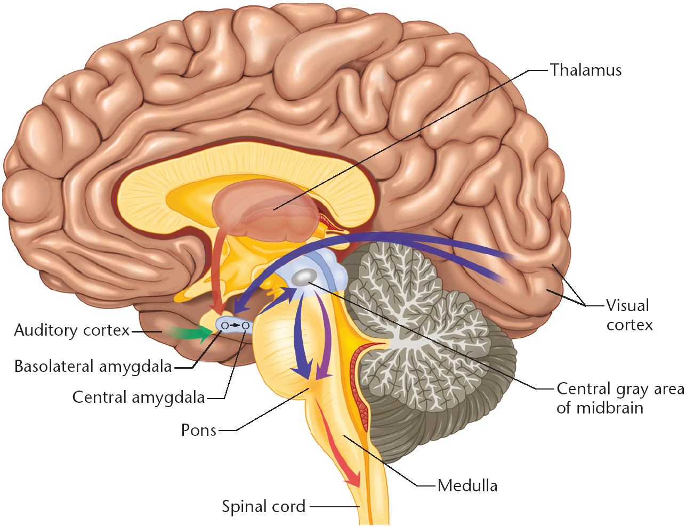
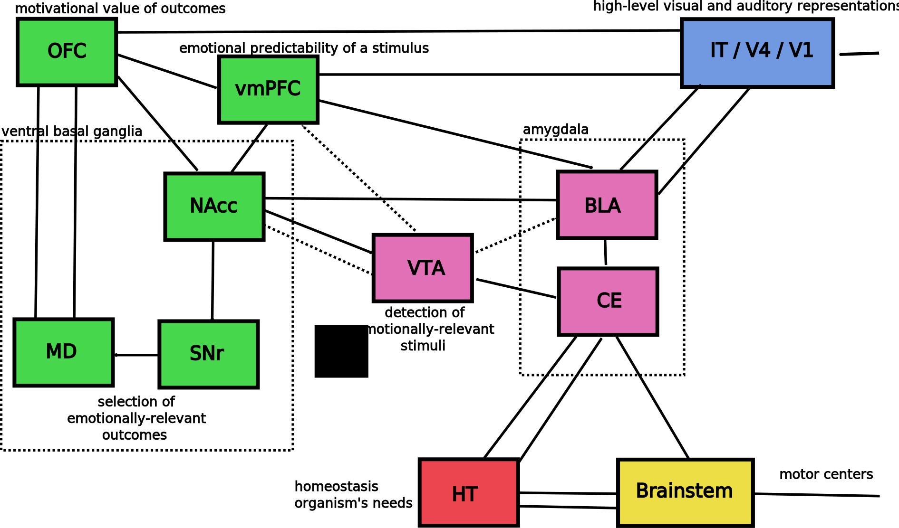

==================================
rst2reveal
==================================

ReST to Reveal.js translator
--------------------------------------

:author: Julien Vitay
:date: August 2013
:email: julien.vitay@gmail.com

Bullet lists
============================

* A first *nested* **list** with ``verbatim code``

* Very `interesting <http://www.google.fr>`_, but if the line is very long what happens? Something special?

    * Also works with nested lists.
    
    * What happens if the line is really really long, does the bullet point go to far away? 

With an additional paragraph...

Enumerated lists
============================

1. An **enumerated** list with a very long line, let's see what happens.

2. Very :strong:`interesting`

Another slide
===================

1- Let's test ``verbatim``

2- And `URLs <http://www.google.fr>`_

What about math?
===================

Inline :math:`x(t)`

Equation:

.. math::

    \tau \frac{dx}{dt} + x = a
    
Also with ``align*`` mode:

.. math::

    a &= b +c \\
    b &= a + 10
    
Code
===========

The Pygments package can very easily highlight Python code using different patterns:

.. code-block:: python

    import numpy as np
    np.ones((10, 10))
    res = a + b
    
This is true for a lot of languages, including C++:

.. code-block:: c++

    void test(){
        int i = 0;
        for(int i=0; i<10; i++){
            sleep(1);
        }
        std::cout << "Hello, World!" << std::endl;
    }
    
Images
==============

    

* Images can be centered and scaled between 0 and 100%

* Aligned to the left 

* or to the right...

Images
==============

Images
==============

    
       
Videos?
==============

.. video:: matthews.webm
    :width: 50%
    :align: center
    :autoplay:

* A video explaining the Active Appearance Model.

* Matthews and Baker (2007)    
    
Raw HTML
================

.. raw:: html

    <b> Some text </b>
    
::

    .. raw:: html

        <b> Some text </b>
    
Admonitions
==========================
    
You can use admonitions, such as note:    
    
.. note:: 

    This is a note   
    
Warning or caution   
    
.. caution::

    This is a warning
      
    

    
Are there subsections?
==========================

This one
++++++++++++++++

is a subsection

This one
++++++++++++++++

is another

And you go back to the previous level and look at very long titles
========================================================================

Citations are with the role ``epigraph``:

.. epigraph::

    "L'important, c'est de bien s'ennuyer."
    
    -- Jean Carmet
    
Incremental reveal
========================

.. class:: fragment

    * First item

    * Second item

    ::
    
        .. class:: fragment

            * First item

            * Second item
